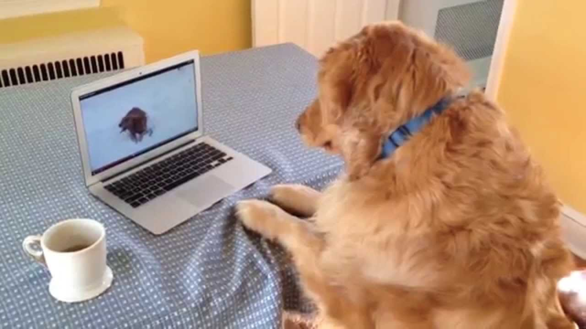

The Minespace Team is a dedicated group of professionals working in an agile scrum development environment to bring Minespace and Core to life.

## Our Mission

At Minespace, our mission is to create innovative and cutting-edge solutions for the mining industry. We strive to develop state-of-the-art technologies that optimize mining operations, enhance safety measures, and minimize environmental impact.

## Our Approach

We follow the agile scrum methodology, allowing us to adapt quickly to evolving requirements and deliver high-quality results efficiently. Our team members collaborate closely, leveraging their diverse expertise to develop robust and reliable software solutions for the mining industry.

## Meet Our Team

### John Smith - Project Manager

John is an experienced project manager with a passion for driving successful software development projects. He ensures that the Minespace team stays on track and delivers exceptional results on time.

### Sarah Johnson - Lead Developer

Sarah is a talented and innovative developer who leads the technical aspects of the Minespace project. Her expertise in software development and mining operations allows her to design and implement cutting-edge solutions.

### David Thompson - UX/UI Designer

David is a creative UX/UI designer who focuses on enhancing user experience and creating intuitive interfaces for Minespace and Core. He ensures that the software is user-friendly and visually appealing.

### Lisa Adams - Quality Assurance Analyst

Lisa is a meticulous quality assurance analyst who conducts thorough testing to ensure that Minespace and Core meet the highest standards of performance and reliability. Her attention to detail guarantees a smooth user experience.

## Contact Us

If you have any inquiries or would like to learn more about Minespace and Core, please feel free to reach out to our team at [email protected]